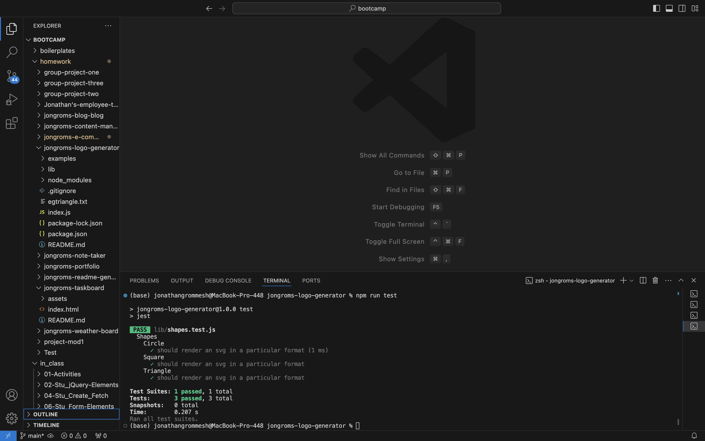

# Simple Logo Generator

In this assignment, I built a command line application that generates simple logos as svg strings. You can make them into a circle, square, or triangle. I included a test suite using the jest package to test for accurate rendering of svg strings. 

## Link to Video Demonstration
[Click here to see the deployed version](https://youtu.be/OocGzR0qiIA)

## Screenshot of Successful Tests

